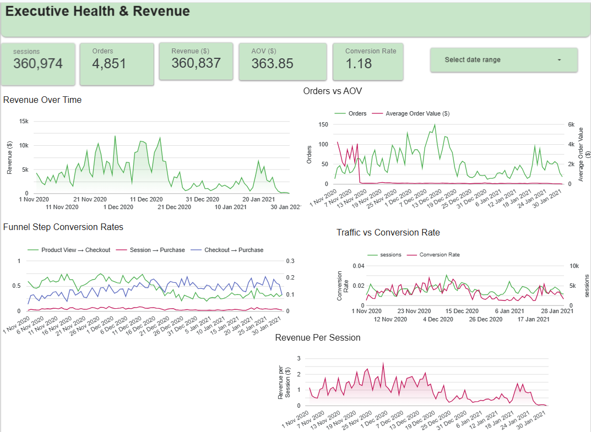
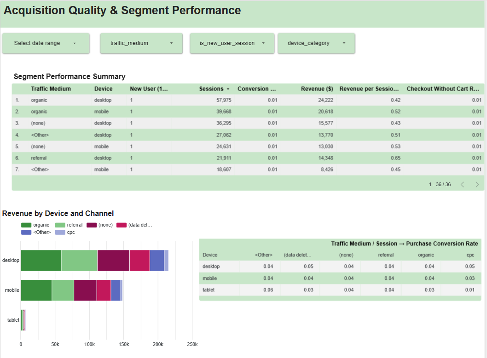
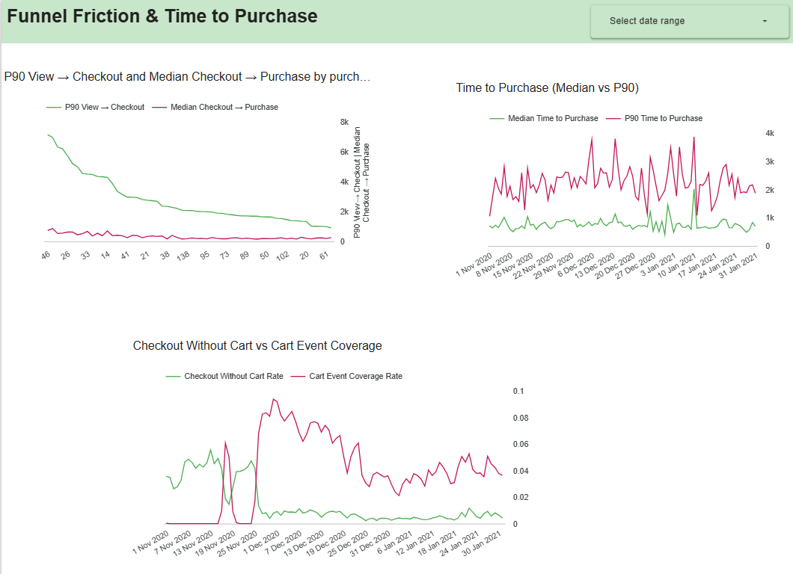

# 📊 GA4 Ecommerce Funnel Analytics — BigQuery + Looker Studio

## Overview

This case study evaluates end-to-end ecommerce funnel performance using event-level behavioral data modeled in Google BigQuery and visualized through interactive Looker Studio dashboards.

The analysis examines how users progress through the purchase funnel, how revenue is distributed across acquisition segments, and where inefficiencies or friction arise in the conversion journey. By combining funnel conversion metrics, revenue indicators, and segment-level performance analysis, the study provides a structured view of the factors influencing monetization outcomes.

This framework supports systematic assessment of user behavior and highlights opportunities to improve conversion efficiency and overall funnel performance.

---

## Live Dashboard

👉 **Interactive dashboard:**   https://lookerstudio.google.com/s/tyfZr_mxm-I

---

## Technologies and Analytical Stack

This project was implemented using a cloud analytics stack designed for event-level behavioral analysis and performance reporting:

* **Google BigQuery** — Analytical data warehouse used to query and aggregate GA4 event data, supporting scalable SQL transformations and computation of session-level funnel metrics and revenue KPIs.

* **SQL Modeling** — Structured SQL views organize event streams into reusable analytical layers, enabling consistent calculation of funnel conversion rates, segment performance metrics, and time-to-purchase statistics.

* **Google Analytics 4 (GA4) BigQuery Export Dataset** — Source ecommerce event dataset containing user interactions, session identifiers, acquisition attributes, and transaction metadata required to reconstruct purchase journeys.

* **Looker Studio** — Dashboarding platform used to build interactive visualizations for monitoring funnel performance, revenue trends, and acquisition quality.

---

## Dataset Description

This analysis is based on the public **Google Analytics 4 (GA4) ecommerce sample dataset** available in BigQuery (`bigquery-public-data.ga4_obfuscated_sample_ecommerce`). The dataset contains anonymized event-level logs that simulate a production ecommerce analytics environment.

The project uses GA4 event records such as **page views, product interactions, checkout actions, and purchases**, along with session identifiers, acquisition attributes, device categories, and transaction metadata. These fields enable reconstruction of session-level purchase journeys and measurement of funnel performance.

The dataset spans a fixed historical period (late 2020 to early 2021) and supports time-series analysis of conversion behavior and revenue trends.

---

## Modeling Approach

Event-level GA4 data is transformed into structured analytical views that support funnel and revenue analysis:

* **Session reconstruction** — events are grouped into unique sessions using GA4 session identifiers
* **Funnel flags** — session-level indicators capture progression through key funnel steps
* **Daily aggregation** — conversion metrics and revenue KPIs are summarized over time
* **Segment analysis** — performance is evaluated by acquisition channel and device
* **Time-to-purchase metrics** — latency between funnel milestones is measured

This layered SQL modeling approach converts raw event streams into stable business metrics suitable for executive reporting and behavioral diagnostics.

## Funnel Performance Analysis

### Executive Summary

Overall traffic volume is stable, but monetization performance is driven more by **mid-funnel efficiency and segment quality** than by raw session growth.

The largest performance differences emerge across acquisition segments and user types, where lower-volume returning-user segments demonstrate materially higher revenue efficiency than high-volume new-user traffic.

Funnel diagnostics show variability in checkout behavior and purchase timing, suggesting friction and inconsistency in user journeys. Improving mid-funnel progression and prioritizing high-efficiency segments represent the clearest opportunities for optimization.

---

## Funnel Structure & Conversion Performance

**Charts used:**

* Funnel Step Conversion Rates
* Traffic vs Conversion Rate

The funnel tracks:

**Session → Product View → Checkout → Purchase**

Findings:

* Session-to-purchase conversion is low relative to total traffic
* The largest drop-off occurs between product interaction and checkout initiation
* Checkout-to-purchase conversion is comparatively stronger and stable

Revenue fluctuations align more closely with conversion efficiency than with session volume, indicating that **mid-funnel optimization has higher leverage than traffic expansion**.

---

## Revenue Performance & Efficiency

**Charts used:**

* Revenue Over Time
* Orders vs AOV
* Revenue per Session

Revenue trends generally follow traffic but show spikes driven by high-value transactions. These outliers affect averages and should be interpreted cautiously.

Revenue per session fluctuates alongside conversion performance, reinforcing that monetization efficiency depends primarily on funnel effectiveness rather than raw traffic growth.

---

## Acquisition & Segment Performance

**Charts used:**

* Segment Performance Summary table
* Revenue by Device and Channel
* Traffic Medium / Session → Purchase Conversion matrix

The largest individual traffic segments are concentrated in **new-user organic traffic**, including:

* Organic · Desktop · New users — **57,975 sessions**
* Organic · Mobile · New users — **39,668 sessions**

These segments generate high volume but modest revenue efficiency.

In contrast, certain returning-user segments deliver significantly higher monetization efficiency. For example:

**Referral · Desktop · Returning users**

* 15,019 sessions
* ~0.03 session→purchase conversion
* $38,381 revenue
* **$2.56 revenue per session**

This represents more than **5× higher revenue per session** than large new-user organic segments.

Traffic quality varies substantially by segment, suggesting that prioritizing efficient channels may improve ROI more effectively than increasing session counts.

---

## Funnel Friction & Time to Purchase

**Charts used:**

* Time to Purchase (Median vs P90)
* P90 View → Checkout & Median Checkout → Purchase
* Checkout Without Cart vs Cart Event Coverage

A persistent gap between median and 90th percentile purchase times indicates that while many users convert quickly, a subset experiences extended journeys.

This long-tail behavior suggests friction or inconsistent checkout flows. Variability in expected funnel steps may reflect either non-linear user behavior or instrumentation inconsistencies.

Standardizing checkout paths and reducing early friction could shorten time-to-conversion and improve efficiency.

---

## Analytical Limitations

* Extreme transaction values introduce volatility in averages
* Small segments produce unstable conversion estimates
* Some anomalies may reflect tracking gaps rather than behavior

These limitations highlight the importance of data validation and cautious interpretation.

---

## Recommendations

1. Improve mid-funnel progression to increase checkout initiation
2. Prioritize investment in high-efficiency returning-user segments
3. Validate tracking and investigate extreme revenue outliers
4. Simplify and standardize checkout flows
5. Apply minimum sample thresholds when evaluating segments

These actions focus on improving efficiency without proportional increases in acquisition spend.

---

## Conclusion

Revenue performance is constrained more by funnel efficiency and segment quality than by traffic shortages.

Mid-funnel friction and acquisition variability represent the primary optimization levers. Targeted improvements in checkout progression and segment prioritization can materially increase monetization without expanding traffic volume.

This project demonstrates how structured data modeling and dashboard analytics support actionable business insights.
